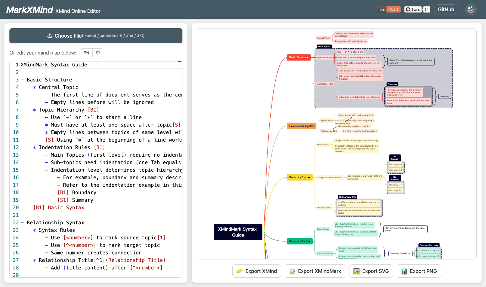

# MarkXMind

[](https://github.com/jinzcdev/markxmind/blob/main/LICENSE)
[](README_zh-CN.md)


**MarkXMind** is an online mind mapping editor that creates mind maps using a Markdown-like syntax (XMindMark), with real-time preview and export to multiple formats. Inspired by [Markmap](https://github.com/markmap/markmap) and [XMindMark](https://github.com/xmindltd/xmindmark).

## ✨ Features

- 🚀 Create complex mind maps with pure text, using simple XMindMark syntax
- 👀 Real-time preview of rendered results
- 💾 Export to multiple formats: `.xmind`, `.xmindmark`, `.svg`, `.png`
- 📤 Import `.xmind` files and convert to XMindMark text
- 🖥️ Runs entirely in the browser, no backend services required
- 🌓 Support for light/dark mode

## 🔗 Online Usage

[👉 Try MarkXMind now](https://jinzcdev.github.io/markxmind/)



## 🚀 Local Development

### Prerequisites

- Node.js (v18 or above)
- npm

### Installation Steps

1. Clone the repository

```bash
git clone https://github.com/jinzcdev/markxmind.git
cd markxmind
```

2. Install dependencies

```bash
npm install
```

3. Start the development server

```bash
npm run serve
```

4. Open your browser and visit `http://localhost:5173`

### Build the Project

```bash
npm run build
```

## 📝 How to Use

### Basic Usage

1. Enter XMindMark text in the editor
2. Preview the generated mind map in real-time on the right
3. Use the toolbar at the bottom to export to different formats

### XMindMark Syntax Introduction

XMindMark syntax is similar to Markdown, using indentation and special symbols to represent the hierarchical structure and relationships of elements in the mind map.

#### Basic Syntax Example:

```
Central Topic

- Topic 1
    * Subtopic 1.1
    * Subtopic 1.2
- Topic 2
    * Subtopic 2.1
        - Subsubtopic 2.1.1
```

#### Special Features:

- **Relationships**: Use `[number]` and `[^number]` to create connections between topics
- **Boundaries**: Use `[B]` or `[Bnumber]` to create boundaries
- **Summaries**: Use `[S]` or `[Snumber]` to create summaries

For detailed syntax, please refer to:

- [XMindMark Syntax Guide](./docs/xmindmark-syntax.md)
- [XMindMark Detailed Specification](./docs/specification.md)

## 🤝 Contributions

Contributions are welcome, whether it's code contributions, bug reports, or new feature suggestions! Please participate through [GitHub Issues](https://github.com/jinzcdev/markxmind/issues) and [Pull Requests](https://github.com/jinzcdev/markxmind/pulls).

## 📄 License

[MIT](LICENSE)
